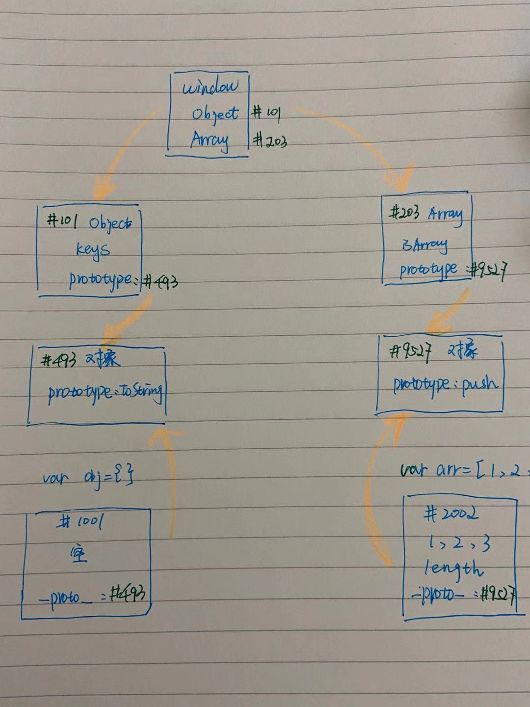

# 共同属性和隐藏属性
## 相同之处：
都存着原型的地址
## 不同之处：
prototype挂在函数上
__proto__挂在每个新生成的对象上
## 举个栗子解释
例如：有个arr, 他有一个隐藏的属性，每个对象都有隐藏的属性，隐藏属性存着arr.prototype对象的地址，arr.join() 发现 arr上米有join,就去隐藏属性对应的对象里找，于是就找到了arr.prototype.join.
## 内存图
